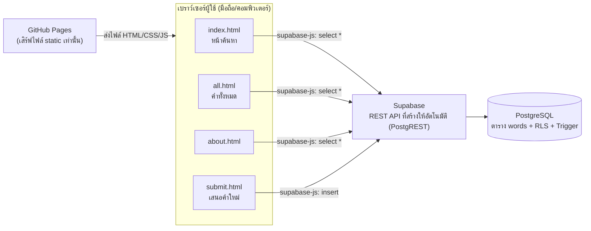

# สถาปัตยกรรมระบบ

เอกสารนี้อธิบายว่าระบบ พจนานุกรมภาษาถิ่นไทย ทำงานอย่างไร และทำไมถึงเลือกออกแบบแบบนี้ สำหรับพื้นหลังการเปลี่ยนแปลงจาก Google Sheets มาเป็น Supabase ดู [`DEVLOG.md`](DEVLOG.md)

---

## แผนภาพระบบ



จุดสำคัญ: ไม่มีเซิร์ฟเวอร์ตรงกลางระหว่างเบราว์เซอร์กับฐานข้อมูล คำขอทุกอันวิ่งจากเบราว์เซอร์ตรงไปยัง Supabase ผ่าน `supabase-js` (โหลดจาก CDN, ไม่มี build step) GitHub Pages ทำหน้าที่แค่เสิร์ฟไฟล์ HTML/CSS/JS ที่เขียนไว้แล้ว ไม่มีส่วนเกี่ยวข้องกับข้อมูล

---

## ทำไมไม่ใช้ Express

- เว็บนี้ deploy บน **GitHub Pages** ซึ่งเสิร์ฟได้เฉพาะไฟล์ static (HTML/CSS/JS) เท่านั้น รันโค้ดฝั่งเซิร์ฟเวอร์อย่าง Node.js/Express ไม่ได้เลยในสภาพแวดล้อมนี้
- ถ้าต้องการ Express จริง ๆ ต้องมีเซิร์ฟเวอร์แยกต่างหาก (เช่น Render, Railway, Vercel Functions) ซึ่งหมายถึงต้อง deploy สองระบบ ดูแลสองที่ และมีค่าใช้จ่าย/ความซับซ้อนเพิ่มขึ้นโดยไม่จำเป็นสำหรับสเกลของโครงงานนี้
- Supabase สร้าง REST API ให้อัตโนมัติจากนิยามตาราง (ผ่าน PostgREST) ทันทีที่สร้างตารางเสร็จ จึงตัดความจำเป็นที่ต้องเขียนและดูแล backend เองออกไปทั้งหมด

---

## ทำไมย้าย logic ลง database

Logic บางอย่าง เช่น "ห้ามเพิ่มคำถิ่นซ้ำ" หรือ "ถ้าคำหยาบต้องเลือกระดับภาษาให้ถูก" ปกติมักเขียนไว้ใน backend layer แต่ระบบนี้ไม่มี backend ให้เขียน จึงย้าย logic เหล่านี้ลงไปเป็นส่วนหนึ่งของฐานข้อมูลแทน ผ่าน:

- **Column constraint** (`NOT NULL`, `UNIQUE`) — กฎพื้นฐานระดับโครงสร้างข้อมูล
- **Trigger function** (เขียนด้วย `plpgsql`) — กฎเชิงธุรกิจที่ซับซ้อนกว่า constraint ธรรมดา เช่น ตรวจเนื้อหาข้อความ

ข้อดีของการวางกฎไว้ที่ฐานข้อมูลแทนที่จะเป็น client-side JavaScript อย่างเดียว: **ต่อให้ข้ามหน้าเว็บไปเลย** (แก้ JavaScript ในเบราว์เซอร์ หรือเรียก Supabase REST API ตรง ๆ ด้วย Postman/curl) กฎที่ฐานข้อมูลก็ยังบังคับใช้อยู่เสมอ เพราะ PostgreSQL เป็นจุดเดียวที่ข้อมูลทุกทางต้องผ่าน

---

## กฎตรวจสอบข้อมูล 4 ด่าน

### ด่านที่ 1 — required field (ฝั่งหน้าเว็บ, `submit.html`)

ตรวจว่าช่องที่ห้ามว่างกรอกครบหรือยัง **ก่อน** ส่งค่าไปที่ Supabase เป็นแค่การช่วยเหลือผู้ใช้ (UX) ให้เห็น error ทันทีโดยไม่ต้องรอ network round-trip ข้ามได้ถ้าผู้ใช้ (หรือคนร้าย) ไม่ผ่านหน้าเว็บนี้:

```js
function validate(){
  clearErrors();
  let ok = true;
  // ... ตรวจทุกช่องที่ห้ามว่าง เช่น
  markInvalid("central", val("central"), "กรุณากรอกคำภาษากลาง");
  markInvalid("region", getRegions().length > 0, "กรุณาเลือกอย่างน้อย 1 ภาค");
  // ฯลฯ
  return ok;
}
```

### ด่านที่ 2 — `NOT NULL` (ฐานข้อมูล, `supabase/schema.sql`)

คอลัมน์ที่ห้ามว่างตามสคีมาถูกบังคับที่ระดับตารางโดยตรง ต่อให้ด่านที่ 1 ถูกข้าม การ insert ที่มีคอลัมน์เหล่านี้เป็นค่าว่างจะถูก PostgreSQL ปฏิเสธเสมอ:

```sql
create table if not exists public.words (
  id          uuid primary key default gen_random_uuid(),
  central     text not null,
  dialect     text not null,
  region      text not null,
  province    text not null,
  reading     text not null,
  pos         text not null,
  level       text not null,
  meaning     text not null,
  example     text,
  example_th  text,
  status      text not null default 'ยืนยัน',
  note        text,
  created_at  timestamptz not null default now(),

  constraint words_dialect_region_unique unique (dialect, region)
);
```

### ด่านที่ 3 — `UNIQUE (dialect, region)` (ฐานข้อมูล, `supabase/schema.sql`)

`constraint words_dialect_region_unique unique (dialect, region)` ในตารางด้านบน กันไม่ให้มีคำถิ่นเดียวกันซ้ำในภาคเดียวกัน (คำเดียวกันแต่คนละภาคยังเพิ่มได้ เพราะถือเป็นคนละแถวข้อมูล)

คอลัมน์ `region` เก็บภาคที่ใช้เป็นสตริงเดียวคั่นด้วยจุลภาค (เช่น `"เหนือ,อีสาน"`) เมื่อคำหนึ่งใช้ได้หลายภาค ค่าที่ insert จริงจึงขึ้นอยู่กับลำดับที่ผู้ส่งติ๊กเช็คบ็อกซ์ในฟอร์ม ถ้าปล่อยตามลำดับติ๊กเฉย ๆ ผู้ส่งสองคนที่เลือกภาคชุดเดียวกันแต่ติ๊กคนละลำดับ (เช่น ติ๊กเหนือก่อนแล้วค่อยอีสาน กับติ๊กอีสานก่อนแล้วค่อยเหนือ) จะได้สตริงคนละค่า (`"เหนือ,อีสาน"` กับ `"อีสาน,เหนือ"`) ทำให้ constraint ไม่จับว่าซ้ำทั้งที่ควรซ้ำ เพื่อป้องกันกรณีนี้ ฝั่งฟอร์ม (`submit.html`) จึงเรียงลำดับภาคที่เลือกตามลำดับคงที่ `["กลาง", "เหนือ", "อีสาน", "ใต้"]` ก่อน join ด้วย `,` ทุกครั้งก่อนบันทึก ไม่ว่าจะติ๊กตามลำดับไหนก็ตาม

### ด่านที่ 4 — Trigger `check_profanity()` (ฐานข้อมูล, `supabase/schema.sql`)

Trigger นี้ทำงานก่อนบันทึกทุกครั้ง (`before insert`) ตรวจว่า `dialect`/`central` มีคำหยาบปนหรือไม่ ถ้ามีแต่ผู้ส่งไม่ได้เลือก `level = 'หยาบ'` จะ `RAISE EXCEPTION` ทันที (ธุรกรรม insert ทั้งหมดถูกยกเลิก):

```sql
create or replace function public.check_profanity()
returns trigger
language plpgsql
as $$
declare
  bad_words text[] := array['เหี้ย', 'สัส', 'ควย', 'เย็ด', 'ตอแหล', 'หี', 'แตด'];
  w text;
begin
  foreach w in array bad_words loop
    if (new.dialect ilike '%' || w || '%' or new.central ilike '%' || w || '%')
       and new.level is distinct from 'หยาบ' then
      raise exception 'คำนี้อาจเป็นคำหยาบ กรุณาเลือก "ระดับภาษา" เป็น หยาบ ก่อนบันทึกคำนี้';
    end if;
  end loop;
  return new;
end;
$$;

drop trigger if exists words_check_profanity on public.words;
create trigger words_check_profanity
  before insert on public.words
  for each row
  execute function public.check_profanity();
```

`bad_words` เป็นลิสต์ตัวอย่างเบื้องต้นเท่านั้น ไม่ครบทุกคำ ผู้ดูแลระบบแก้ไข/เพิ่มคำในลิสต์นี้ได้เองภายหลังผ่าน SQL Editor โดยไม่กระทบโค้ดฝั่งหน้าเว็บเลย

ด่านที่ 1 อยู่ฝั่ง client ส่วนด่านที่ 2-4 อยู่ฝั่งฐานข้อมูลทั้งหมด และผูกกับ **RLS policy** ที่อนุญาตเฉพาะ `SELECT`/`INSERT` ให้ทุกคน แต่ไม่มี policy ให้ `UPDATE`/`DELETE` เลย (ดู policy เต็มใน `supabase/schema.sql`) — เมื่อเปิด RLS แล้ว การกระทำที่ไม่มี policy อนุญาตไว้จะถูกปฏิเสธเสมอ

---

## ข้อจำกัดของสถาปัตยกรรมนี้

- **ไม่มีเซิร์ฟเวอร์กลาง** จึง logic ที่ซับซ้อนกว่านี้ (ส่งอีเมลแจ้งเตือนตอนมีคำใหม่, ทำ batch job, เรียก API ภายนอกที่ต้องซ่อน secret key) ทำไม่ได้ในสถาปัตยกรรมปัจจุบัน ต้องเพิ่มเซิร์ฟเวอร์แยกถ้าจะทำเรื่องพวกนี้ในอนาคต
- **anon key ฝังอยู่ในโค้ดฝั่งหน้าเว็บเสมอ** (ดูได้ตรง ๆ จาก view-source) ความปลอดภัยทั้งหมดของระบบจึงขึ้นอยู่กับ RLS policy ล้วน ๆ ถ้าตั้ง policy ผิดพลาด (เช่น เผลอเปิด `UPDATE`/`DELETE` ให้ `anon`) ข้อมูลทั้งตารางจะเสี่ยงทันที
- **Trigger ตรวจคำหยาบเป็น pattern matching ธรรมดา** (`ilike '%คำ%'`) ไม่ใช่ NLP จึงมีคำหยาบที่หลุดผ่านได้ (คำสะกดแปลก, คำใหม่ที่ยังไม่อยู่ใน `bad_words`) และมีโอกาส false positive กับคำที่บังเอิญมีคำหยาบเป็นส่วนหนึ่งของคำอื่น
- **`UNIQUE (dialect, region)` กันคำซ้ำแบบตรงตัวอักษรเป๊ะเท่านั้น** คำที่สะกดต่างกันเล็กน้อย (เว้นวรรค ตัวสะกดต่าง) จะไม่ถูกจับว่าซ้ำ
- **`UNIQUE (dialect, region)` เทียบค่า `region` เป็นสตริงทั้งเส้น ไม่ได้แยกเป็นรายภาค** ถ้าคำเดียวกันถูกส่งเข้ามาด้วยชุดภาคที่ต่างกัน (เช่น `"เหนือ"` กับ `"เหนือ,อีสาน"`) จะไม่ถูกจับว่าซ้ำ เพราะสตริงทั้งสองไม่เหมือนกันเป๊ะ ทั้งที่ทับซ้อนกันอยู่บางส่วน ทางแก้ระยะยาวคือแยกความสัมพันธ์คำ-ภาคออกเป็นตารางลูก (เช่น `word_regions` แบบ one-to-many) แทนการเก็บภาคหลายค่าไว้ในคอลัมน์ `region` เดียวเป็นสตริง
- **ระบบเป็น auto-approve ไม่มีขั้นตอนอนุมัติก่อนเผยแพร่** คำที่ผ่านกฎ 4 ด่านแล้วจะขึ้นแสดงบนหน้าเว็บทันที ข้อมูลที่ผิดพลาดหรือไม่เหมาะสม (แต่ไม่เข้าเงื่อนไข trigger ตรวจคำหยาบ) จะปรากฏอยู่บนเว็บจนกว่าผู้ดูแลจะเข้าไปแก้ไขหรือลบด้วยมือผ่าน Supabase Dashboard
- **ไม่มีระบบยืนยันตัวตนผู้ส่ง (auth)** ทุกคนที่เข้าเว็บได้เพิ่มคำได้อย่างเสรีตาม RLS ที่ตั้งไว้ (by design) จึงยังต้องพึ่งการตรวจทานโดยทีมงานอยู่ดี แต่เนื่องจาก RLS ไม่มี policy อนุญาต `UPDATE` เลย (ดูหัวข้อกฎตรวจสอบข้อมูล 4 ด่านด้านบน) ทีมงานจึงแก้ค่าคอลัมน์ `status` จากฝั่งหน้าเว็บหรือผ่าน API ไม่ได้ ต้องเข้าไปแก้โดยตรงผ่าน Supabase Dashboard (Table Editor) เท่านั้น ซึ่งใช้สิทธิ์ admin ที่ข้าม RLS ไปได้ ไม่ใช่ระบบที่ป้องกัน spam ได้ 100%
- **ยังไม่มี rate limit** ใคร ๆ ก็เรียก Supabase REST API ตรง ๆ ซ้ำ ๆ ได้ไม่จำกัดจำนวนครั้ง (นอกเหนือจาก quota ระดับโปรเจกต์ของ Supabase เอง) เปิดช่องให้ spam คำใหม่จำนวนมากในเวลาอันสั้นได้
- **Trigger `check_profanity()` ตรวจแค่คอลัมน์ `dialect` และ `central` เท่านั้น** ไม่ครอบคลุมคอลัมน์ `meaning` หรือ `example`/`example_th` ซึ่งเป็นข้อความอิสระที่ผู้ส่งพิมพ์เองได้เช่นกัน คำหยาบจึงหลุดเข้าระบบผ่านช่องเหล่านี้ได้โดยไม่ถูกกฎด่านที่ 4 จับ
